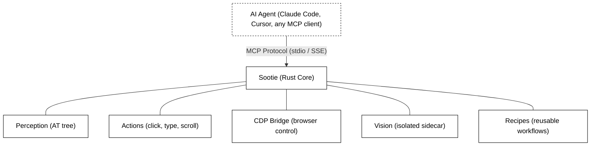
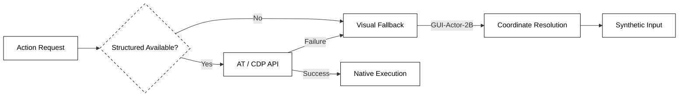

<div align="center">

</div>
<h1 align="center">Sootie</h1>
<p align="center"><em>Cross-platform computer-use for AI agents.</em></p>

<p align="center">
  <a href="LICENSE"></a>
  
  
  
</p>

---

Your AI agent can write code, run tests, search files. But it can't click a button, send an email, or fill out a form. It lives inside a chat box.

Sootie changes that. One install, and any AI agent can see and operate every app on your Mac, Windows, or Linux desktop.

## Quick Start

### 1. Installation

**macOS**

```bash
# Homebrew (recommended)
brew tap joe223/sootie
brew install sootie

# Or use install script
curl -fsSL https://raw.githubusercontent.com/joe223/sootie/main/install.sh | bash
```

**Linux**

```bash
curl -fsSL https://raw.githubusercontent.com/joe223/sootie/main/install.sh | bash
```

**Windows**

```powershell
# Scoop (recommended)
scoop bucket add sootie https://github.com/joe223/sootie
scoop install sootie

# Or use PowerShell install script
iwr -useb https://raw.githubusercontent.com/joe223/sootie/main/install.ps1 | iex
```

**Via Agent (Claude Code / OpenCode / etc.)**

Copy and paste this to your AI agent:

```text
Install Sootie for me from https://github.com/joe223/sootie. Use Homebrew on macOS, the install script (https://raw.githubusercontent.com/joe223/sootie/main/install.sh) on Linux, or Scoop on Windows. After installation, run `sootie setup` to initialize.
```

The agent will detect your platform and execute the appropriate command.

### 2. Initialization

After installation, run:

```bash
sootie setup
```

This configures permissions, Chrome CDP, and optionally downloads the vision sidecar model (~2GB).

### 3. Usage (MCP Configuration)

To use Sootie, configure your AI agent (like Claude Code, Cursor, or any MCP client) to start the Sootie server.

**Example: Claude Desktop Configuration** (`claude_desktop_config.json`):
```json
{
  "mcpServers": {
    "sootie": {
      "command": "sootie",
      "args": ["serve"]
    }
  }
}
```

**Example: Cursor Configuration**:
Go to `Settings` -> `Features` -> `MCP Servers` and add:
- Name: `sootie`
- Type: `command`
- Command: `sootie serve`

---

## Why Sootie?

Other computer-use tools are either platform-locked or rely on screenshots and pixel guessing. Sootie reads the native accessibility tree on each platform for structured, labeled data about every element in every app. When the accessibility tree isn't enough, it falls back to CDP for precise browser control, then to a vision model for visual grounding.

- **Cross-platform** — macOS, Windows, Linux. One API, any OS.
- **Accessibility-first** — Native AT tree (AX/UIA/AT-SPI2) for structured data. CDP for browsers. Vision fallback when needed.
- **CDP-first for web** — Chrome DevTools Protocol bypasses the unreliable accessibility tree for web apps. No more AXGroup guessing.
- **Local vision** — Isolated vision sidecar running locally for offline scenarios.
- **Transparent workflows** — Recipes are JSON. Read every step before running. No black box.
- **Open** — MCP protocol. Works with Claude Code, Cursor, VS Code, or any MCP client.

| | | Sootie | Ghost OS | Browser-use | Anthropic Computer Use | OpenAI Operator |
|:---:|------|:--:|:--:|:--:|:--:|:--:|
| 🖥️ | **Platforms** | macOS, Windows, Linux | macOS only | Browser only | Linux (Docker env) | Browser only |
| 👀 | **How it sees** | AT tree + CDP + Vision | AT tree + Vision | Playwright (DOM) | Screenshots only | Screenshots only |
| 🌐 | **Web apps** | CDP-first (precise DOM) | AX fallback (unreliable) | Playwright (DOM) | Pixel guessing | Pixel guessing |
| 🧠 | **Workflows** | JSON recipes | JSON recipes | Code/Scripts | No | No |
| 🔒 | **Data stays local** | Yes (tool itself) | Yes (tool itself) | Yes (tool itself) | Depends | No (cloud) |
| 📖 | **Open source** | Apache 2.0 | MIT | MIT | Reference only | No |

## How It Works

Sootie connects to your AI agent through the [Model Context Protocol (MCP)](https://modelcontextprotocol.io) and exposes tools to see and operate your desktop.



Built in Rust. The core is a single lightweight binary, with an optional isolated sidecar process for local vision fallback. By default, `sootie serve` writes runtime logs to a platform-local file under the Sootie data directory.

### The Action Cascade

Sootie is designed around a reliable, multi-tier fallback architecture. It attempts to execute every action using the fastest, most precise method available, automatically degrading to visual models only when structured data fails.



**1. Structural First (AT / CDP)**
Sootie always prefers exact, structural targets.
- For desktop applications, it uses OS-level Accessibility APIs (macOS AXUIElement, Windows UIAutomation, Linux AT-SPI2).
- For web applications, it connects directly via the Chrome DevTools Protocol (CDP) to parse the DOM tree.
- *Why?* It's instantaneous, exact, unaffected by screen resolution, and supports background execution or off-screen elements.

**2. Visual Fallback (GUI-Actor-2B)**
When an application uses custom rendering (e.g., Canvas, Flutter, older Qt apps) and does not expose proper accessibility trees, structured parsing fails.
- Sootie captures the current window or screen state.
- It passes the screenshot and the requested UI `Selector` (e.g., `role: button, name: Compose`) to **GUI-Actor-2B**, a lightweight vision model running locally in an isolated **Sidecar process**.
- The sidecar architecture ensures that heavy ML inference environments don't bloat the main Rust binary and prevents GPU/inference crashes from taking down the MCP server.
- The model visually parses the UI and returns the exact `(x, y)` coordinates of the target element.

**3. Synthetic Execution**
If structural execution is unavailable or fails, Sootie uses the coordinates resolved by the Visual Fallback to simulate hardware-level input events.
- It injects low-level OS mouse clicks (e.g., macOS `CGEvent`, Windows `SendInput`) at the calculated `(x, y)` location.
- Keyboard input is similarly simulated to ensure the application reacts exactly as if a human user interacted with it.

## Platform Support

| Capability | macOS | Windows | Linux |
|-----------|-------|---------|-------|
| Accessibility tree | AX API (AXUIElement) | UI Automation (UIA) | AT-SPI2 |
| Input simulation | CGEvent | SendInput | XTest / libei |
| Screen capture | CGWindowListCreateImage | GDI / DXGI | XCB / PipeWire |
| Browser control | CDP | CDP | CDP |
| Visual fallback | GUI-Actor-2B (Sidecar) | GUI-Actor-2B (Sidecar) | GUI-Actor-2B (Sidecar) |

## Tools

Core interaction tools are backend-agnostic. Sootie uses one normalized target contract across native apps and web apps. Target-driven tools accept a nested `target` object with optional `app` and `window` scopes plus a required `selector` object.

### Selector Scheme

Selectors describe the target element, not the backend used to reach it. The scheme defines both flexible inputs for querying and stable outputs for resolved targets.

#### 1. Input (Target Selection)
Query tools such as `sootie_find`, `sootie_inspect`, and `sootie_wait` accept the same nested
`target` shape used by target-driven action tools.

- **App Input**: Can be a string (`"Chrome"`) or a partial object (`{ "name": "Chrome", "is_frontmost": true }`).
- **Window Input**: Can be a string (`"Gmail"`) or a partial object to resolve ambiguity (`{ "title": "Gmail", "index": 0 }`).
- **Selector Input**: Matches based on provided constraints (`{ "role": "button", "name": "Compose" }`).

*Example Input:*
```json
{
  "target": {
    "app": "Chrome",
    "window": { "title": "Gmail", "focused": true },
    "selector": {
      "role": "button",
      "name": "Compose"
    }
  }
}
```

#### 2. Output (Resolved Target)
When tools like `sootie_context` or `sootie_find` return a target, they always use a stable,
fully resolved object structure. Agents should lift the relevant selector fields from this output
into a canonical action `target` object rather than passing the resolved payload back unchanged.

**App Object**
- `name` (string): Full application name (e.g., `"Google Chrome"`)
- `bundle_id` (string): Exact OS package identifier (e.g., `"com.google.Chrome"`)
- `is_frontmost` (boolean): Whether this app currently has OS focus

**Window Object**
- `id` (string): Exact OS-level or browser-level window ID (e.g., `"win_42"`)
- `title` (string): Full window or tab title
- `index` (number): 0-based depth index (`0` is frontmost)
- `focused` (boolean): Whether this window is active within its app
- `bounds` (object): Window screen coordinates and size (`{ "x": 0, "y": 0, "width": 1440, "height": 900 }`)

**Element Object**
- `role` (string): Normalized UI role (e.g., `"button"`)
- `name` (string): Accessible label or computed name
- `text` (string): Visible text content (if applicable)
- `id` (string): Backend-specific ID (e.g., DOM id or AXIdentifier)
- `state` (object): Current states (`{ "visible": true, "focused": false, "enabled": true }`)
- `bounds` (object): Screen coordinates and size (`{ "x": 100, "y": 200, "width": 50, "height": 20 }`)
- `index` (number): 0-based index to disambiguate identical siblings

> **Note on Deep Inspection:** While `sootie_find` returns a list of matching `Element Objects`, using `sootie_inspect` on a single target returns a deep inspection payload including its immediate `children`, the `backend` used, supported `actions`, and the backend-specific `raw_metadata` for advanced recipe authoring.

*Example Output (`sootie_find`):*
```json
{
  "status": "unique",
  "backend": "at_tree",
  "app": {
    "name": "Google Chrome",
    "bundle_id": "com.google.Chrome",
    "is_frontmost": true
  },
  "window": {
    "id": "win_1042",
    "title": "Inbox - user@gmail.com - Gmail",
    "index": 0,
    "focused": true,
    "bounds": { "x": 0, "y": 25, "width": 1440, "height": 875 }
  },
  "elements": [
    {
      "role": "button",
      "name": "Compose",
      "id": "dom_compose_btn",
      "state": { "visible": true, "enabled": true },
      "bounds": { "x": 120, "y": 85, "width": 100, "height": 36 },
      "coordinate": { "x": 170, "y": 103 },
      "index": 0
    }
  ],
  "confidence": null
}
```

### Perception

| Tool | What it does |
|------|-------------|
| `sootie_context` | Get the macro environment state: a tree of running apps and their open windows (with titles, IDs, and focus state). Does not include UI elements. |
| `sootie_find_element` | Find UI elements from a short element description. Returns element positions, bounds, and metadata. |
| `sootie_find_apps` | Find installed applications by name pattern (supports wildcards like '*Chrome*') |

### Action

Action tools publish the same nested v2 target shape through `tools/list`:

- `target.app` (optional): app scope
- `target.window` (optional): window scope
- `target.selector` (required): at least one of `role`, `name`, `text`, or `id`
- `sootie_drag` uses `from_target` and `to_target`

Every `tools/call` response now includes `structuredContent`:

- Success: `{ "success": true, "message": "", "data": ... }`
- Tool-level failure: `{ "success": false, "message": "...", "data": { "code", "details" } }`

JSON-RPC errors remain reserved for invalid MCP envelope/method dispatch.

| Tool | What it does | Additional Parameters |
|------|-------------|----------------------|
| `sootie_launch` | Launch a desktop app | None |
| `sootie_find` | Resolve a canonical structured target | `target` with `selector`, optional `app`/`window` |
| `sootie_find_element` | Find UI elements from a short element description | `el_description` (string), optional `window` scope |
| `sootie_click` | Click a canonical action target | `target` as either `{ "selector": ... }` or `{ "coordinate": { "x", "y" } }`, `button`, `count` |
| `sootie_type` | Type text into the focused element, or into a canonical action target when provided | `text` (string), optional `target`, `clear_first` (boolean) |
| `sootie_press` | Press a key, optionally focusing a canonical action target first | `key` (e.g., "Return", "Tab", "Escape"), optional `target` |
| `sootie_hotkey` | Press key combinations | `keys` (array of strings, e.g., `["Cmd", "C"]`) |
| `sootie_scroll` | Scroll at a canonical action target | `target`, `direction` ("up"/"down"/"left"/"right"), `amount` (integer) |
| `sootie_drag` | Drag between two canonical action targets | `from_target`, `to_target` |

### Window & Focus

| Tool | What it does |
|------|-------------|
| `sootie_focus` | Bring any app or window to the front |
| `sootie_window` | Minimize, maximize, close, move, or resize a window. `move` requires `x` and `y`; `resize` requires `width` and `height` |

### Workflow

| Tool | What it does |
|------|-------------|
| `sootie_recipes` | List all installed workflows |
| `sootie_run` | Execute a workflow with parameters |
| `sootie_recipe_save` | Save a new workflow |
| `sootie_recipe_delete` | Remove a workflow |

## Recipes

When your agent figures out a workflow, it saves it as a recipe. A recipe is a JSON file with steps and normalized selectors. Sootie's internal Action Cascade automatically handles backend routing (AT/CDP/Vision) across different platforms.

```json
{
  "schema_version": 3,
  "name": "gmail-send",
  "platforms": ["macos", "windows", "linux"],
  "params": [
    { "name": "to", "type": "string", "required": true },
    { "name": "subject", "type": "string", "required": true },
    { "name": "body", "type": "string", "required": false }
  ],
  "steps": [
    {
      "action": "click",
      "target": {
        "app": "Chrome",
        "window": "Gmail",
        "selector": {
          "name": "Compose",
          "role": "button"
        }
      }
    },
    {
      "action": "wait",
      "target": {
        "selector": {
          "role": "textfield",
          "name": "To"
        }
      },
      "timeout": 5000
    },
    {
      "action": "type",
      "target": {
        "selector": {
          "role": "textfield",
          "name": "To"
        }
      },
      "text": "${to}"
    }
  ]
}
```

- Recipes are just JSON. Read every step before running.
- Share with your team. One person learns the workflow, everyone benefits.
- Canonical targets stay portable even when backend choice differs by platform.

## License

Apache 2.0
