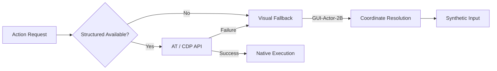

<div align="center">

</div>
<h1 align="center">Sootie</h1>
<p align="center"><em>Cross-platform computer-use for AI agents.</em></p>

<p align="center">
  <a href="LICENSE"></a>
  
  
  
</p>

---

Your AI agent can write code, run tests, search files. But it can't click a button, send an email, or fill out a form. It lives inside a chat box.

Sootie changes that. One install, and any AI agent can see and operate every app on your Mac, Windows, or Linux desktop.

## Why Sootie?

Other computer-use tools are either platform-locked or rely on screenshots and pixel guessing. Sootie reads the native accessibility tree on each platform for structured, labeled data about every element in every app. When the accessibility tree isn't enough, it falls back to CDP for precise browser control, then to a vision model for visual grounding.

- **Cross-platform** — macOS, Windows, Linux. One API, any OS.
- **Accessibility-first** — Native AT tree (AX/UIA/AT-SPI2) for structured data. CDP for browsers. Vision fallback when needed.
- **CDP-first for web** — Chrome DevTools Protocol bypasses the unreliable accessibility tree for web apps. No more AXGroup guessing.
- **Cloud + local vision** — Cloud VLM API for instant use. Local ONNX model for offline scenarios.
- **Transparent workflows** — Recipes are JSON. Read every step before running. No black box.
- **Open** — MCP protocol. Works with Claude Code, Cursor, VS Code, or any MCP client.

| | | Sootie | Ghost OS | Anthropic Computer Use | OpenAI Operator |
|:---:|------|:--:|:--:|:--:|:--:|
| 🖥️ | **Platforms** | macOS, Windows, Linux | macOS only | Any (via pixels) | Browser only |
| 👀 | **How it sees** | AT tree + CDP + Vision | AT tree + Vision | Screenshots only | Screenshots only |
| 🌐 | **Web apps** | CDP-first (precise DOM) | AX fallback (unreliable) | Pixel guessing | Pixel guessing |
| 🧠 | **Workflows** | JSON recipes | JSON recipes | No | No |
| 🔒 | **Data stays local** | Yes (with optional cloud VLM) | Yes | Depends | No (cloud) |
| 📖 | **Open source** | Apache 2.0 | MIT | No | No |

## How It Works

Sootie connects to your AI agent through [MCP](https://modelcontextprotocol.io) and gives it tools to see and operate your desktop. It uses the native accessibility tree on each platform for structured data. For web apps, it uses Chrome DevTools Protocol for precise DOM control. When neither works, a vision model finds elements visually.

```
AI Agent (Claude Code, Cursor, any MCP client)
    │
    │ MCP Protocol (stdio / SSE)
    │
Sootie
    │
    ├── Perception ──── see what's on screen (AT tree)
    ├── Actions ─────── click, type, scroll, keys
    ├── CDP Bridge ──── precise browser control (CDP)
    ├── Vision ──────── visual grounding (cloud + local)
    └── Recipes ─────── reusable workflows
```

Built in Rust. Single binary. No runtime dependencies.

By default, `sootie serve` writes runtime logs to a platform-local file under the Sootie data directory. Use `--log-file` to override that path explicitly.

## Platform Support

| Capability | macOS | Windows | Linux |
|-----------|-------|---------|-------|
| Accessibility tree | AX API (AXUIElement) | UI Automation (UIA) | AT-SPI2 |
| Input simulation | CGEvent | SendInput | XTest / libei |
| Screen capture | CGWindowListCreateImage | GDI / DXGI | XCB / PipeWire |
| Browser control | CDP | CDP | CDP |
| Visual fallback | GUI-Actor-2B (ONNX) | GUI-Actor-2B (ONNX) | GUI-Actor-2B (ONNX) |

## Testing

Sootie has comprehensive E2E tests covering all MCP tools and user scenarios.

### Running Tests

```bash
# Run all tests
cargo test --workspace

# Run E2E tests
cargo test --package sootie-tests

# Run with coverage
./tests/scripts/run-tests-with-coverage.sh
```

### Test Architecture

- **tests/ directory**: Independent black-box E2E tests
- **TestEnv**: Auto-launch Chrome/HTTP servers
- **FixturesLoader**: Centralized test data management
- **Coverage target**: 80%+ statements, 90%+ functions

See [docs/superpowers/specs/2026-05-02-e2e-test-architecture-design.md](docs/superpowers/specs/2026-05-02-e2e-test-architecture-design.md) for full design.

## Action Cascade Architecture

Sootie is designed around a reliable, multi-tier fallback architecture. It attempts to execute every action using the fastest, most precise method available, automatically degrading to visual models only when structured data fails.



### 1. Structural First (AT / CDP)
Sootie always prefers exact, structural targets.
- For desktop applications, it uses OS-level Accessibility APIs (macOS AXUIElement, Windows UIAutomation, Linux AT-SPI2).
- For web applications, it connects directly via the Chrome DevTools Protocol (CDP) to parse the DOM tree.
- **Why?** It's instantaneous, exact, unaffected by screen resolution, and supports background execution or off-screen elements.

### 2. Visual Fallback (GUI-Actor-2B)
When an application uses custom rendering (e.g., Canvas, Flutter, older Qt apps) and does not expose proper accessibility trees, structured parsing fails.
- Sootie captures the current window or screen state.
- It passes the screenshot and the requested UI `Selector` (e.g., `role: button, name: Compose`) to **GUI-Actor-2B**, a lightweight vision model running locally via ONNX Runtime.
- The model visually parses the UI and returns the exact `(x, y)` coordinates of the target element.

### 3. Synthetic Execution
If structural execution is unavailable or fails, Sootie uses the coordinates resolved by the Visual Fallback to simulate hardware-level input events.
- It injects low-level OS mouse clicks (e.g., macOS `CGEvent`, Windows `SendInput`) at the calculated `(x, y)` location.
- Keyboard input is similarly simulated to ensure the application reacts exactly as if a human user interacted with it.

## Tools

Core interaction tools are backend-agnostic. Sootie uses one normalized UI selector scheme across native apps and web apps, built around fields such as `app`, `window`, `role`, `name`, `text`, and `state`. In browser context, Sootie can still prefer CDP automatically without requiring a separate click/type/find API.

### Selector Scheme

Selectors describe the target element, not the backend used to reach it. The scheme defines both flexible inputs for querying and stable outputs for resolved targets.

#### 1. Input (Target Selection)
When providing a target to tools like `sootie_find` or `sootie_click`, the input supports flexible shorthand and partial matching.

- **App Input**: Can be a string (`"Chrome"`) or a partial object (`{ "name": "Chrome", "is_frontmost": true }`).
- **Window Input**: Can be a string (`"Gmail"`) or a partial object to resolve ambiguity (`{ "title": "Gmail", "index": 0 }`).
- **Element Input**: Matches based on provided constraints (`{ "role": "button", "name": "Compose" }`).

*Example Input:*
```json
{
  "app": "Chrome",
  "window": { "title": "Gmail", "focused": true },
  "role": "button",
  "name": "Compose"
}
```

#### 2. Output (Resolved Target)
When tools like `sootie_context` or `sootie_find` return a target, they always use a stable, fully resolved object structure. This exact object can be safely passed back into action tools.

**App Object**
- `name` (string): Full application name (e.g., `"Google Chrome"`)
- `bundle_id` (string): Exact OS package identifier (e.g., `"com.google.Chrome"`)
- `is_frontmost` (boolean): Whether this app currently has OS focus

**Window Object**
- `id` (string): Exact OS-level or browser-level window ID (e.g., `"win_42"`)
- `title` (string): Full window or tab title
- `index` (number): 0-based depth index (`0` is frontmost)
- `focused` (boolean): Whether this window is active within its app
- `bounds` (object): Window screen coordinates and size (`{ "x": 0, "y": 0, "width": 1440, "height": 900 }`)

**Element Object**
- `role` (string): Normalized UI role (e.g., `"button"`)
- `name` (string): Accessible label or computed name
- `text` (string): Visible text content (if applicable)
- `id` (string): Backend-specific ID (e.g., DOM id or AXIdentifier)
- `state` (object): Current states (`{ "visible": true, "focused": false, "enabled": true }`)
- `bounds` (object): Screen coordinates and size (`{ "x": 100, "y": 200, "width": 50, "height": 20 }`)
- `index` (number): 0-based index to disambiguate identical siblings

> **Note on Deep Inspection:** While `sootie_find` returns a list of matching `Element Objects`, using `sootie_inspect` on a single target returns a deep inspection payload including its immediate `children`, the `backend` used, supported `actions`, and the backend-specific `raw_metadata` for advanced recipe authoring.

*Example Output (sootie_find):*
```json
{
  "status": "unique",
  "total_matches": 1,
  "app": {
    "name": "Google Chrome",
    "bundle_id": "com.google.Chrome",
    "is_frontmost": true
  },
  "window": {
    "id": "win_1042",
    "title": "Inbox - user@gmail.com - Gmail",
    "index": 0,
    "focused": true,
    "bounds": { "x": 0, "y": 25, "width": 1440, "height": 875 }
  },
  "elements": [
    {
      "role": "button",
      "name": "Compose",
      "id": "dom_compose_btn",
      "state": { "visible": true, "enabled": true },
      "bounds": { "x": 120, "y": 85, "width": 100, "height": 36 },
      "index": 0
    }
  ]
}
```

### Perception

| Tool | What it does |
|------|-------------|
| `sootie_context` | Get the macro environment state: a tree of running apps and their open windows (with titles, IDs, and focus state). Does not include UI elements. |
| `sootie_find` | Resolve UI targets across desktop apps and web apps with the unified selector scheme |
| `sootie_inspect` | Return normalized metadata and the full sub-tree for one resolved target, with backend-specific details when available |
| `sootie_wait` | Pause execution until a target matches a specific state (e.g., `{ "visible": true }`) or a timeout occurs |
| `sootie_screenshot` | Capture a screen, window, or region screenshot |

### Action

Action tools accept either a structured `target` (using the Selector Scheme) or direct `coordinate`s. When a `target` is provided, Sootie automatically triggers the Action Cascade to locate the element before acting.

**Common Parameters (for click, type, hover, drag):**
- `target` (object, optional): A Selector Scheme Input object (e.g., `{ "app": "Chrome", "name": "Compose" }`).
- `coordinate` (object, optional): Direct screen coordinates (e.g., `{ "x": 500, "y": 300 }`).
- *Note: You must provide exactly one of `target` or `coordinate`.*

| Tool | What it does | Additional Parameters |
|------|-------------|----------------------|
| `sootie_launch` | Launch a desktop app | None |
| `sootie_click` | Click a resolved target or coordinates | `button` (left/right/middle), `count` (1/2/3) |
| `sootie_type` | Type into a resolved target or current cursor | `text` (string), `clear_first` (boolean) |
| `sootie_press` | Press a single key | `key` (e.g., "Return", "Tab", "Escape") |
| `sootie_hotkey` | Press key combinations | `keys` (array of strings, e.g., `["Cmd", "C"]`) |
| `sootie_scroll` | Scroll up, down, left, or right | `direction` ("up"/"down"/"left"/"right"), `amount` (number) |
| `sootie_hover` | Hover over a resolved target or coordinates | None |
| `sootie_drag` | Drag from one resolved target or point to another | `to_target` or `to_coordinate` |

### Window & Focus

| Tool | What it does |
|------|-------------|
| `sootie_focus` | Bring any app or window to the front |
| `sootie_window` | Minimize, maximize, close, move, or resize a window |

### Workflow

| Tool | What it does |
|------|-------------|
| `sootie_recipes` | List all installed workflows |
| `sootie_run` | Execute a workflow with parameters |
| `sootie_recipe_save` | Save a new workflow |
| `sootie_recipe_delete` | Remove a workflow |

## Recipes

When your agent figures out a workflow, it saves it as a recipe. A recipe is a JSON file with steps and normalized selectors. Sootie's internal Action Cascade automatically handles backend routing (AT/CDP/Vision) across different platforms.

```json
{
  "schema_version": 3,
  "name": "gmail-send",
  "platforms": ["macos", "windows", "linux"],
  "params": [
    { "name": "to", "type": "string", "required": true },
    { "name": "subject", "type": "string", "required": true },
    { "name": "body", "type": "string", "required": false }
  ],
  "steps": [
    {
      "action": "click",
      "target": {
        "app": "Chrome",
        "window": "Gmail",
        "name": "Compose",
        "role": "button",
        "state": { "visible": true }
      }
    },
    {
      "action": "wait",
      "target": {
        "role": "textfield",
        "name": "To"
      },
      "timeout": 5000
    },
    {
      "action": "type",
      "target": {
        "role": "textfield",
        "name": "To"
      },
      "text": "${params.to}"
    }
  ]
}
```

- Recipes are just JSON. Read every step before running.
- Share with your team. One person learns the workflow, everyone benefits.
- Normalized selectors stay portable even when backend choice differs by platform.

## Install

```bash
# macOS (Homebrew)
brew install sootie
sootie setup

# Windows (Scoop)
scoop install sootie
sootie setup

# Linux (cargo)
cargo install sootie-cli
sootie setup
```

`sootie setup` handles permissions, MCP configuration, and optional vision model installation.

## Build From Source

```bash
git clone https://github.com/joe223/sootie.git
cd sootie
cargo build --release
./target/release/sootie setup
```

Requires Rust 1.75+ and platform-specific dependencies (see `docs/platforms.md`).

## Contributing

See [CONTRIBUTING.md](CONTRIBUTING.md). We need:
- Platform-specific testing and bug reports
- Recipes for more apps
- Vision model improvements
- Documentation

## License

Apache 2.0
