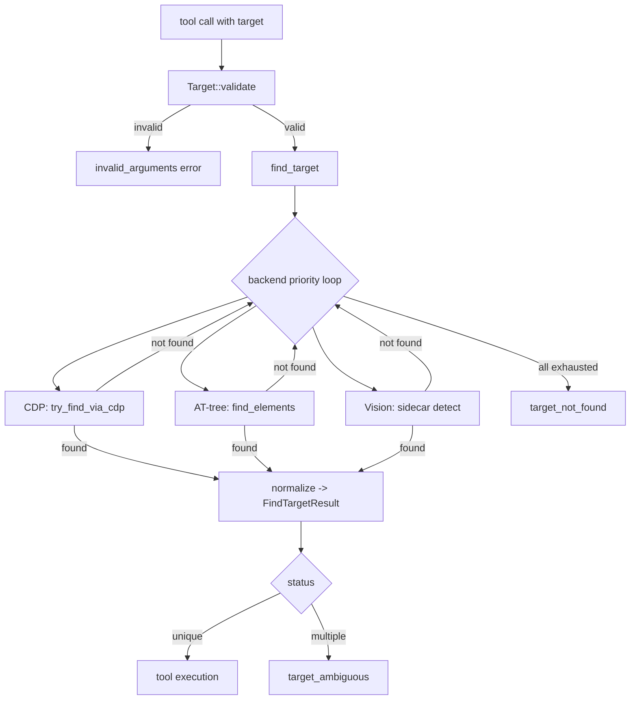
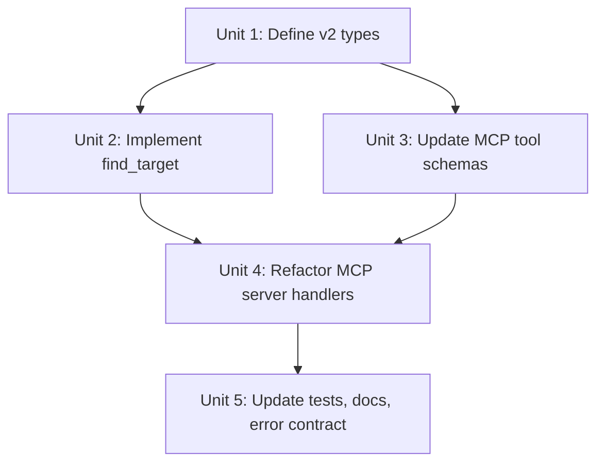

# Implement Target-Driven API v2

## Overview

Implement the v2 target-driven API contract defined in `docs/api/target-driven-api-v2.md`. The core change is replacing the current flat, per-tool selector parsing and backend resolution with a single `find_target(target)` function that all target-driven tools delegate to. This eliminates hidden dependencies between tool calls, removes focus-dependent implicit behavior, and gives agents one stable element-targeting contract to learn.

## Problem Frame

Today, each target-driven tool (find, inspect, wait, click, type, hover, scroll, drag) implements its own argument parsing, validation, and backend resolution path. Query tools call `perception.find()` directly; action tools go through `Cascade::resolve_coordinate()`. The `Selector` type uses flattened element fields (role/name/text/id/state at the top level alongside app/window), and tool schemas accept top-level selector keys. Backend ordering is configured via environment variable. Error codes lack `target_not_found` and `target_ambiguous` variants.

The v2 spec defines four rules:
1. Tool calls are stateless and independent.
2. Any tool that acts on a UI element accepts an explicit `target` parameter.
3. All `target`-accepting tools delegate element resolution to one internal function: `find_target(target)`.
4. `find_target(target)` resolves elements through configured backends in user-defined order, then returns one unified result structure.

## Requirements Trace

- R1. Introduce a unified nested `Target` type with `app`, `window`, and `selector` sub-objects matching the v2 spec schema (origin: spec lines 33-102).
- R2. Implement `find_target(target) -> FindTargetResult` as the single resolution function for all target-driven tools (origin: spec lines 129-146).
- R3. `FindTargetResult` must include `status`, `backend`, `backend_attempts`, `app`, `window`, `elements` list, and `confidence` metadata (origin: spec lines 299-380).
- R4. Each `ResolvedElement` must include `role`, `name`, `id`, `text`, `state`, `bounds`, `coordinate`, `index`, and `confidence` (origin: spec lines 362-376).
- R5. Validation must be strict and shared: missing selector, empty app/window objects, invalid types all fail with `invalid_arguments` before any backend lookup (origin: spec lines 103-128).
- R6. Backend resolution order must be configurable and followed exactly. The existing `SOOTIE_FALLBACK_PRIORITY` env var mechanism is preserved and used (origin: spec lines 157-175).
- R7. Error contract must include `invalid_arguments`, `target_not_found` with `backend_attempts`, `execution_failed` (origin: spec lines 626-680). `target_ambiguous` is no longer an error — multiple matches return the list for agent evaluation.
- R8. All target-driven MCP tool schemas must advertise the nested target shape (origin: spec lines 352-389).
- R9. All target-driven MCP tool handlers must delegate to `find_target` and use `elements[0].coordinate` for action tools (origin: spec lines 393-620).
- R10. Non-target-driven tools are unchanged except `screenshot` which accepts `scope` schema for app/window bounds (origin: spec lines 61-86, 382).
- R11. `sootie_type` and `sootie_scroll` require `target` with no implicit focus fallback (origin: spec lines 520-542, 580-604).

## Scope Boundaries

- NOT changing backend provider internals (CDP, AT-tree, Vision) beyond what is needed to return `FindTargetResult`.
- NOT renaming tools or removing tool families.
- NOT redesigning recipe semantics.
- NOT introducing a TOML config file for backend priority — the existing `SOOTIE_FALLBACK_PRIORITY` env var is sufficient for v2. TOML config can be a follow-up.
- NOT adding `coordinate` support to `find_target` in this iteration — the spec defines `find_target` for selector-based resolution only. Coordinate-based actions bypass `find_target` as they do today.

## Context & Research

### Relevant Code and Patterns

- `crates/sootie-core/src/selector.rs`: `Selector`, `AppSelector`, `WindowSelector`, `ElementSelector`, `ResolvedTarget`, `Element`, `Coordinate`, `Bounds`, `MatchStatus` — primary types to extend or replace.
- `crates/sootie-core/src/cascade.rs`: `Cascade`, `Backend`, `resolve_coordinate()`, `resolve_selector_coordinate()`, `resolve_fallback_priority()` — current unified resolution, to be refactored into `find_target`.
- `crates/sootie-core/src/action.rs`: `ActionTarget`, action structs — types to update with new target shape.
- `crates/sootie-mcp/src/tools.rs`: `all_tools()`, schemas, `parse_action_target()`, `parse_selector_from_args_strict()`, validation helpers — schemas and parsers to replace.
- `crates/sootie-mcp/src/server.rs`: `SootieServer`, all `tool_*` handlers, `ToolInvocationError`, `handle_tool_call()` — handlers to refactor to use `find_target`.
- `crates/sootie-mcp/src/types.rs`: `ToolDefinition`, `CallToolResult`, `ToolContent` — result envelope types.
- `crates/sootie-core/src/platform/macos/action/utils.rs`: `resolve_target()` wrapper — to be updated.
- `crates/sootie-mcp/tests/e2e.rs`: E2E tests for MCP contract verification.
- `crates/sootie-core/src/selector.rs` (lines 292-1081): comprehensive selector unit tests — pattern to follow.

### Institutional Learnings

- Plan 003 (`docs/plans/2026-05-07-003-refactor-mcp-tool-api-contract-plan.md`) established the canonical `target` field on action tools, structured error envelopes, and compatibility routing. The v2 spec builds on this by making the target shape universally nested and centralizing resolution in `find_target`.

### External References

- None required. The v2 spec and existing codebase patterns are sufficient.

## Key Technical Decisions

- **Introduce `Target` as a new type alongside `Selector`, not as a replacement**: The existing `Selector` type is deeply integrated into perception providers, CDP matching, and platform-specific find implementations. Introducing `Target` as the MCP-facing contract and converting to `Selector` internally preserves backward compatibility in `sootie-core` internals while delivering the v2 API surface. (see origin: spec lines 33-59)
- **`find_target` lives in `cascade.rs`**: It is the natural home — `cascade.rs` already owns backend ordering, the `Cascade` struct, and the `Backend` enum. The function replaces `Cascade::resolve_coordinate()` for selector-based resolution. (see origin: spec lines 129-146)
- **`FindTargetResult` replaces `ResolvedTarget` for v2 tools**: `ResolvedTarget` returns `Vec<Element>` and lacks a `coordinate` field. `FindTargetResult` returns a single `element` and always includes `coordinate`. Query tools (`find`, `inspect`) that need multiple matches can still use `ResolvedTarget` internally, but the MCP-facing result uses `FindTargetResult`. (see origin: spec lines 296-348)
- **Non-target-driven tools are untouched**: `sootie_context`, `sootie_screenshot`, `sootie_find_apps`, `sootie_press`, `sootie_hotkey`, `sootie_launch`, `sootie_focus`, `sootie_window`, and recipe tools do not participate in `find_target`. Their contracts remain stable. (see origin: spec lines 377-389)
- **The existing `SOOTIE_FALLBACK_PRIORITY` env var drives backend ordering**: No new config format is introduced in v2. The existing `resolve_fallback_priority()` function is reused. (see origin: spec lines 157-175)
- **Strict validation at the target boundary, not per-backend**: Validation of target structure happens once in `find_target`, before any backend is invoked. Backends receive a pre-validated, normalized target. (see origin: spec lines 103-128)

## Open Questions

### Resolved During Planning

- **Should `find_target` handle coordinates?** No. The spec defines `find_target` for selector-based resolution. Coordinate-based action tools can continue to bypass `find_target` and perform direct coordinate actions as they do today.
- **Should `find_target` be async?** Yes — backends (CDP, Vision) perform I/O. The function signature is `async fn find_target(target: &Target, ...) -> FindTargetResult`.
- **Where does `Target` validation live?** In `selector.rs` alongside `Target` itself, as a `Target::validate() -> Result<(), TargetValidationError>` method. `find_target` calls this first, then proceeds to backend resolution.
- **Should `FindTargetResult` return multiple elements?** Yes. Query tools return the full list; action tools use `elements[0]`. Each element includes `coordinate` and `confidence`.
- **Where does `coordinate` belong?** Each `ResolvedElement` includes its own `coordinate` (element center). No top-level coordinate field.
- **Should `backend_attempts` be in error contract?** Yes. `FindTargetResult` includes `backend_attempts: Vec<Backend>` on failure; error envelope references it.
- **Should screenshot use scope schema?** Yes. Screenshot is non-target-driven but accepts app/window scoping via `scope` schema (defined in spec).
- **Should type/scroll require target?** Yes. Both require `target` parameter. No implicit focus fallback.

### Deferred to Implementation

- Exact error message text for each validation failure case.
- Exact `confidence` structure for each backend (vision, at_tree, cdp).

## High-Level Technical Design

> *This illustrates the intended approach and is directional guidance for review, not implementation specification. The implementing agent should treat it as context, not code to reproduce.*

### New Types

```rust
// selector.rs
pub struct Target {
    pub app: Option<AppSelector>,
    pub window: Option<WindowSelector>,
    pub selector: TargetSelector,
}

pub struct TargetSelector {
    pub role: Option<String>,
    pub name: Option<String>,
    pub id: Option<String>,
    pub text: Option<String>,
}

pub struct FindTargetResult {
    pub status: MatchStatus,  // existing enum: Unique, Multiple, None
    pub backend: Backend,
    pub backend_attempts: Option<Vec<Backend>>,
    pub app: Option<ResolvedApp>,
    pub window: Option<ResolvedWindow>,
    pub elements: Vec<ResolvedElement>,  // list, empty if None
    pub confidence: Option<serde_json::Value>,
}

pub struct ResolvedApp {
    pub name: String,
    pub bundle_id: Option<String>,
    pub is_frontmost: bool,
}

pub struct ResolvedWindow {
    pub id: String,
    pub title: String,
    pub index: u32,
    pub focused: bool,
    pub bounds: Bounds,
    pub display_id: u32,
}

pub struct ResolvedElement {
    pub role: String,
    pub name: Option<String>,
    pub text: Option<String>,
    pub id: Option<String>,
    pub state: ElementState,
    pub bounds: Bounds,
    pub coordinate: Coordinate,  // element center
    pub index: u32,
    pub confidence: Option<f64>,
}

pub struct ElementState {
    pub visible: bool,
    pub focused: bool,
    pub enabled: bool,
}
```

### Resolution Flow



### Target-to-Selector Conversion

`find_target` converts `Target` to `Selector` internally before calling backends, so existing backend implementations need no changes:

```rust
impl From<&Target> for Selector {
    // Maps Target { app, window, selector: TargetSelector { role, name, id, text } }
    //   to Selector { app, window, element: ElementSelector { role, name, id, text, state: None } }
}
```

## Implementation Units



- [x] **Unit 1: Define v2 types and conversion from Target to Selector**

**Goal:** Introduce `Target`, `TargetSelector`, `FindTargetResult`, and supporting types in `selector.rs`, plus a `Target -> Selector` conversion so backends receive the same input shape they do today.

**Requirements:** R1, R3

**Dependencies:** None

**Files:**
- Modify: `crates/sootie-core/src/selector.rs`
- Test: `crates/sootie-core/src/selector.rs` (existing `#[cfg(test)] mod tests`)

**Approach:**
- Add `Target` struct with `app: Option<AppSelector>`, `window: Option<WindowSelector>`, `selector: TargetSelector`.
- Add `TargetSelector` with `role`, `name`, `id`, `text` (all `Option<String>`).
- Add `Target::validate() -> Result<(), TargetValidationError>` implementing the strict rules from the spec: selector must exist, at least one selector field must be present, if app/window is present it must have at least one valid field, empty app/window objects are rejected.
- Add `TargetValidationError` enum with descriptive variants.
- Implement `From<&Target> for Selector` to convert the nested target into the existing flat selector shape for backend compatibility.
- Add `FindTargetResult` with `status`, `backend`, `backend_attempts`, `app`, `window`, `elements`, `confidence` matching the v2 spec JSON schema.
- Add `ResolvedElement` with `role`, `name`, `id`, `text`, `state`, `bounds`, `coordinate`, `index`, `confidence`.
- Add `ResolvedApp`, `ResolvedWindow`, `ElementState`, `Bounds`, `Coordinate` types.
- Ensure all types derive `Serialize`, `Deserialize`, `Debug`, `Clone`, `PartialEq`.

**Patterns to follow:**
- Existing `Selector` and `AppSelector` types in `crates/sootie-core/src/selector.rs`.
- Existing `MatchStatus` enum for `status` field.

**Test scenarios:**
- Happy path: `Target` with all fields populated validates successfully and converts to `Selector` with matching fields.
- Happy path: `Target` with only `selector.role` validates successfully.
- Happy path: `FindTargetResult` with `elements` list serializes correctly with each element having `coordinate` and optional `confidence`.
- Edge case: `Target` with `app: Some(AppSelector { name: None, bundle_id: None, is_frontmost: None })` fails validation (empty app object).
- Edge case: `Target` with `window: Some(WindowSelector { title: None, id: None, index: None, focused: None })` fails validation (empty window object).
- Edge case: `TargetSelector` with all fields `None` fails validation.
- Edge case: `FindTargetResult` with `status: None` has empty `elements` and populated `backend_attempts`.
- Error path: Missing `selector` field produces clear error.
- Error path: Round-trip: `Target` serializes to JSON matching the v2 spec schema shape, deserializes back to identical struct.
- Error path: Round-trip: `FindTargetResult` with multiple elements serializes/deserializes correctly.

**Verification:**
- `cargo test -p sootie-core -- selector` passes with new types covered.
- A reviewer can see the v2 spec JSON examples and the Rust types have the same shape.

- [x] **Unit 2: Implement find_target and FindTargetResult normalization**

**Goal:** Implement `find_target(target, perception, vision) -> FindTargetResult` in `cascade.rs` as the single resolution entry point for all target-driven tools.

**Requirements:** R2, R3, R5

**Dependencies:** Unit 1

**Files:**
- Modify: `crates/sootie-core/src/cascade.rs`
- Test: `crates/sootie-core/src/cascade.rs` (existing `#[cfg(test)] mod tests`)

**Approach:**
- Add `find_target()` as a public async function in `cascade.rs`.
- Signature: `async fn find_target(target: &Target, perception: &P, vision: Option<&V>) -> FindTargetResult` where `P: PerceptionProvider`, `V: VisionProvider`.
- Internally, `find_target`:
  1. Calls `Target::validate()` — early return with error on failure.
  2. Converts `Target` to `Selector` via `From<&Target>`.
  3. Iterates backends in priority order from `resolve_fallback_priority()`.
  4. For each backend, attempts resolution. On first success with ≥1 match:
     - Normalize all matched elements to `ResolvedElement` list with `coordinate` (element center).
     - If vision backend, include `confidence` scores for each element and top-level `confidence` metadata.
     - Order elements by confidence descending (vision) or by position index (at-tree).
     - Return `FindTargetResult { status: unique/multiple, backend, elements, confidence, ... }`.
  5. If all backends exhausted, returns `FindTargetResult { status: None, backend_attempts: [...], elements: [] }`.
- Normalization: each matched element includes its own `coordinate` (center) and optional `confidence` score.
- The `backend_attempts` field is populated on failure (status: None) to inform error reporting.
- The existing `Cascade::resolve_coordinate()` remains for coordinate-based `ActionTarget` but selector-based resolution now goes through `find_target`.

**Patterns to follow:**
- Existing `Cascade::resolve_selector_coordinate()` for the backend iteration loop (lines 93-120 of `cascade.rs`).
- Existing `try_backend()` dispatch (line 122) for per-backend dispatch.
- Existing mock providers in `cascade.rs` tests (lines 302-540) for test patterns.

**Test scenarios:**
- Happy path: `find_target` with a valid role-only target returns `FindTargetResult { status: Unique, elements: [one element with coordinate], ... }`.
- Happy path: `find_target` with app+window+role target scopes resolution correctly.
- Happy path: Vision backend returns multiple elements ordered by confidence descending (highest first).
- Edge case: When the first-priority backend returns no matches, the next backend is tried.
- Edge case: When a backend returns multiple matches, `status: Multiple` and `elements` list is populated.
- Edge case: When all backends return no matches, `status: None`, `elements: []`, and `backend_attempts: ["vision", "cdp", "at_tree"]`.
- Edge case: Each `ResolvedElement` in the list has its own `coordinate` (element center).
- Error path: Invalid `Target` (empty selector) is rejected before any backend is called.
- Integration: `find_target` with mock providers matches the backend priority order from `resolve_fallback_priority()`.

**Verification:**
- `cargo test -p sootie-core -- cascade` passes with new function covered.
- Mock-based tests prove backend ordering, normalization, and status semantics.

- [x] **Unit 3: Update MCP tool schemas to v2 target shape**

**Goal:** Update all target-driven tool JSON schemas in `tools.rs` to advertise the nested v2 target shape.

**Requirements:** R7

**Dependencies:** Unit 1

**Files:**
- Modify: `crates/sootie-mcp/src/tools.rs`
- Test: `crates/sootie-mcp/src/tools.rs` (existing `#[cfg(test)] mod tests`)

**Approach:**
- Replace flat top-level selector fields in query tool schemas (`sootie_find`, `sootie_inspect`, `sootie_wait`) with nested `target.selector` shape.
- Replace `canonical_target_schema()` and `action_selector_target_schema()` with a single `target_schema()` that produces the v2 nested shape.
- Add `scope_schema()` for non-target-driven tools that accept app/window scoping without selector (e.g., `screenshot`).
- The new `target_schema` shape:
  ```json
  {
    "target": {
      "type": "object",
      "properties": {
        "app": { /* AppSelector schema */ },
        "window": { /* WindowSelector schema */ },
        "selector": {
          "type": "object",
          "properties": {
            "role": { "type": "string" },
            "name": { "type": "string" },
            "id": { "type": "string" },
            "text": { "type": "string" }
          },
          "required": []
        }
      },
      "required": ["selector"]
    }
  }
  ```
- The new `scope_schema` shape:
  ```json
  {
    "scope": {
      "type": "object",
      "properties": {
        "app": { /* AppSelector schema */ },
        "window": { /* WindowSelector schema */ }
      },
      "required": []
    }
  }
  ```
- Action tools (`sootie_click`, `sootie_type`, `sootie_hover`, `sootie_scroll`) use `target_schema()` with `required: ["target"]`.
- `sootie_drag` uses `from_target` and `to_target` fields, each with `target_schema()`.
- `sootie_screenshot` uses `scope_schema()` for optional app/window bounds.
- Non-target-driven tool schemas (except `screenshot`) are unchanged.
- Remove `state` from selector schemas — `state` is on the resolved element, not the request selector.

**Patterns to follow:**
- Existing `app_selector_schema()` and `window_selector_schema()` helper functions in `tools.rs`.
- Existing `ToolDefinition` builder pattern in `all_tools()`.

**Test scenarios:**
- Happy path: `tools/list` response includes the nested `target.selector` shape for `sootie_find`, `sootie_click`, `sootie_type`, `sootie_scroll`.
- Happy path: `sootie_drag` schema has `from_target` and `to_target` with nested target shapes.
- Happy path: `sootie_screenshot` schema has `scope` with app/window but no selector.
- Edge case: `sootie_context`, `sootie_press`, `sootie_hotkey`, `sootie_launch` schemas are unchanged (no target or scope).
- Error path: Schema validation produces the correct `required` fields for each tool class (`target` required for action tools, `selector` required in target).
- Integration: New schemas deserialize correctly via `serde_json::from_value::<Target>()` and `serde_json::from_value::<Scope>()`.

**Verification:**
- `cargo test -p sootie-mcp -- tools` passes with updated schemas.
- Manual inspection: a `tools/list` call returns schemas matching the v2 spec shape.

- [x] **Unit 4: Refactor MCP server handlers to use find_target**

**Goal:** Refactor all target-driven tool handlers in `server.rs` to delegate to `find_target` instead of implementing their own parse/validate/resolve logic.

**Requirements:** R4, R6, R8

**Dependencies:** Units 1, 2, 3

**Files:**
- Modify: `crates/sootie-mcp/src/server.rs`
- Test: `crates/sootie-mcp/src/server.rs` (existing `#[cfg(test)] mod tests`)
- Test: `crates/sootie-mcp/tests/e2e.rs`

**Approach:**
- Add new `ToolInvocationError` constructors: `target_not_found(message, details)` and `target_ambiguous(message, details)`.
- Add a shared helper in `server.rs` (or `tools.rs`) that deserializes `Target` from args and calls `find_target`, mapping results:
  - `Ok(FindTargetResult { status: None, .. })` → `target_not_found` error with `backend_attempts`
  - `Ok(FindTargetResult { status: Unique/Multiple, elements: [e0, ...], .. })` → return the result for downstream use
  - `Err(TargetValidationError)` → `invalid_arguments` error
- Refactor `tool_find`: deserialize `Target` from args, call `find_target`, return full `FindTargetResult` JSON (including all elements).
- Refactor `tool_inspect`: deserialize `Target`, call `find_target`, use `elements[0]` for inspection.
- Refactor `tool_wait`: deserialize `Target`, call `find_target` to get the scope, then call `perception.wait()`.
- Refactor `tool_click`: deserialize `Target`, call `find_target`, require `status != None`, click at `elements[0].coordinate`.
- Refactor `tool_type`: deserialize `Target` (required), call `find_target`, require `status != None`, use `elements[0].coordinate`.
- Refactor `tool_hover`: deserialize `Target`, call `find_target`, require `status != None`, hover at `elements[0].coordinate`.
- Refactor `tool_scroll`: deserialize `Target` (required), call `find_target`, require `status != None`, scroll at `elements[0].coordinate`.
- Refactor `tool_drag`: deserialize `from_target` and `to_target`, call `find_target` for each, require both `status != None`, drag between `elements[0].coordinate` from each.
- Remove `parse_action_target()`, `parse_optional_action_target()`, `parse_selector_from_args_strict()`, `validate_query_selector()`, `validate_action_selector()`, `selector_field_keys_present()`, `has_selector_values()` from `tools.rs`.
- Remove `tool_compatibility_warnings()` — the v2 schema is the only accepted shape.
- Non-target-driven tool handlers are unchanged.
- `screenshot` tool uses `scope` schema (not `target`) for app/window scoping.

**Patterns to follow:**
- Existing `ToolInvocationError` constructors `invalid_arguments()` and `execution()` in `server.rs` (lines 38-54).
- Existing handler patterns: `tool_click` (line 442), `tool_type` (line 475), `tool_drag` (lines 569+).

**Test scenarios:**
- Happy path: `sootie_find` with `{target: {selector: {role: "button"}}}` returns `FindTargetResult` with full `elements` list and confidence metadata.
- Happy path: `sootie_click` with valid target clicks at `elements[0].coordinate`.
- Happy path: `sootie_drag` with valid `from_target` and `to_target` drags between `elements[0].coordinate` from each.
- Happy path: `sootie_type` and `sootie_scroll` require `target` (no implicit focus fallback).
- Happy path: `screenshot` accepts `scope` schema (not `target`) for app/window bounds.
- Edge case: `sootie_find` with multiple matches returns all elements in list, ordered by confidence.
- Error path: `sootie_click` with empty selector returns `invalid_arguments` with descriptive message.
- Error path: `sootie_find` with no matches returns `target_not_found` with `backend_attempts` list.
- Error path: Invalid tool arguments (malformed JSON, wrong types) produce `invalid_arguments` before `find_target` is called.
- Integration: Non-target-driven tools (`sootie_press`, `sootie_hotkey`, `sootie_launch`, `sootie_focus`, `sootie_window`, `sootie_screenshot`, recipes) continue to work unchanged.

**Verification:**
- `cargo test -p sootie-mcp` passes for unit tests.
- `cargo test -p sootie-tests` passes for E2E tests (or tests are updated where the v2 contract changes expected shapes).

- [x] **Unit 5: Update tests, docs, and error contract**

**Goal:** Ensure tests reflect the v2 contract, add coverage for the new error codes, and update documentation.

**Requirements:** R6, R9

**Dependencies:** Units 1-4

**Files:**
- Modify: `crates/sootie-mcp/tests/e2e.rs`
- Modify: `crates/sootie-mcp/src/server.rs` (error code tests)
- Modify: `docs/api/target-driven-api-v2.md` (update status from draft to implemented)
- Test: `tests/protocol-compliance/handshake.rs` (if target shapes appear in protocol tests)

**Approach:**
- Add E2E test cases for each error code: `invalid_arguments` (malformed target), `target_not_found` (valid target but no match), `target_ambiguous` (multiple matches), `execution_failed` (backend failure after resolution).
- Update existing E2E tests that use flat selector shapes to use the nested v2 target shape.
- Verify `tools/list` output matches v2 schema shapes.
- Verify non-target-driven tools are not affected by the refactor.
- Update `docs/api/target-driven-api-v2.md` status to `implemented` with implementation date.

**Patterns to follow:**
- Existing `assert_tool_success()` and `assert_tool_error()` helpers in `tests/src/assertions.rs`.
- Existing E2E test patterns in `crates/sootie-mcp/tests/e2e.rs`.

**Test scenarios:**
- Happy path: Full E2E flow: `find` a target with multiple elements, then `click` the first one (`elements[0]`), using v2 nested target shapes.
- Happy path: `find` returns elements ordered by confidence (vision backend) or by index (at-tree backend).
- Happy path: Each element in `find` result has its own `coordinate` field.
- Error path: Malformed `target` (missing `selector`) returns `invalid_arguments`.
- Error path: Valid target with no matching element returns `target_not_found` with `backend_attempts` list.
- Edge case: All non-target-driven tools (`context`, `press`, `hotkey`, `launch`, `focus`, `window`, `recipes`, `run`, `recipe_save`, `recipe_delete`, `screenshot`, `find_apps`) continue to accept their current input shapes and return expected results.
- Edge case: `screenshot` with `scope` schema (not `target`) returns expected app/window bounds.
- Integration: `tools/list` schemas match the v2 spec for all target-driven tools.

**Verification:**
- `cargo test --workspace` passes with all tests updated.
- A reviewer can correlate each test scenario back to the v2 spec error contract.

## System-Wide Impact

- **Interaction graph:** The refactor touches the full MCP edge: `tools/list` schemas, all target-driven `tools/call` handlers, the `cascade.rs` resolution pipeline, and `selector.rs` types. Query tools (find, inspect, wait) and action tools (click, type, hover, scroll, drag) all converge on `find_target`.
- **Error propagation:** `Target::validate()` catches structural errors before backend lookup. `find_target` maps resolution outcomes to `FindTargetResult` status. Server handlers translate status into `ToolInvocationError` codes. Non-target-driven tools propagate errors as before.
- **State lifecycle risks:** The highest risk is breaking existing MCP clients that send flat selector shapes. Since plan 003 already introduced the `target` field and compatibility warnings, the v2 transition hardens this by removing legacy acceptance. Unit 4 removes the compatibility layer; any downstream breakage is intentional and documented.
- **API surface parity:** Tool schemas, runtime handlers, `FindTargetResult` serialization, and `docs/api/target-driven-api-v2.md` must describe the same shapes.
- **Integration coverage:** The critical cross-layer scenarios are: `tools/list` → schema publication, `tools/call` → `find_target` → backend resolution → `FindTargetResult` → handler logic, and error code mapping from `FindTargetResult.status` to `ToolInvocationError`.
- **Unchanged invariants:** Tool names remain stable. JSON-RPC remains the transport. Backend routing remains internal to `sootie-core`. Non-target-driven tool contracts are untouched. Recipe semantics are unchanged.

## Risks & Dependencies

| Risk | Mitigation |
|------|------------|
| Breaking existing MCP clients using flat selector shapes | The v2 spec explicitly removes compatibility. Plan 003's compatibility phase is complete. Update README and docs to show only v2 shapes. |
| Backend implementations assume `Selector` input shape | `From<&Target> for Selector` conversion in Unit 1 ensures backends receive the same `Selector` they do today. |
| `FindTargetResult` shape mismatch with `ResolvedTarget` used by internal code | Introduce `FindTargetResult` as the v2 public type. Keep `ResolvedTarget` for internal perception provider returns. Convert between them in `find_target` normalization. |
| Test coverage gaps after removing old shape handlers | Unit 5 explicitly adds E2E coverage for all v2 error paths and updates existing tests to use the new shape. |

## Documentation / Operational Notes

- `docs/api/target-driven-api-v2.md` status should be updated from `draft` to `implemented` upon completion.
- README tool examples should be updated to show v2 nested target shapes (can be a follow-up documentation task).
- The removal of compatibility warnings means agents sending flat selector shapes will receive `invalid_arguments` errors instead of deprecation warnings.

## Sources & References

- **Origin document:** `docs/api/target-driven-api-v2.md`
- Related plan: `docs/plans/2026-05-07-003-refactor-mcp-tool-api-contract-plan.md`
- Related code: `crates/sootie-core/src/selector.rs`
- Related code: `crates/sootie-core/src/cascade.rs`
- Related code: `crates/sootie-core/src/action.rs`
- Related code: `crates/sootie-mcp/src/tools.rs`
- Related code: `crates/sootie-mcp/src/server.rs`
- Related code: `crates/sootie-mcp/src/types.rs`
- Related tests: `crates/sootie-mcp/tests/e2e.rs`
- Related tests: `crates/sootie-mcp/src/tools.rs` (unit tests)
- Related tests: `crates/sootie-mcp/src/server.rs` (unit tests)
- Related tests: `crates/sootie-core/src/cascade.rs` (unit tests)
- Related docs: `docs/api/target-driven-api-v2.md`
